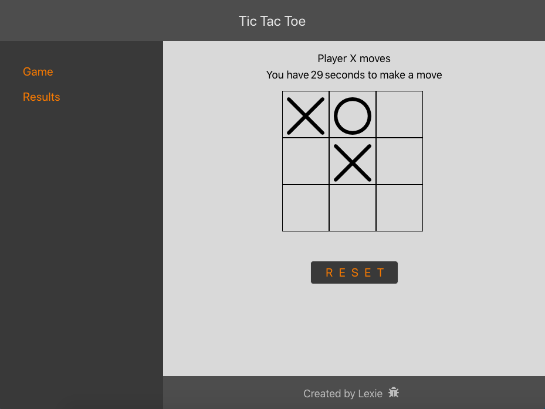

# Tic Tac Toe

Two pages React application which represents Classic Tic Tac Toe game with the responsive layout.

## Rules:
 - each player has 30 seconds to make a move. 
 - after this time finishes, a move automatically comes to the next player.

## App's functionality:
1. Grid (where X and O are images).
2. Timer (each player has 30 seconds to make a move.
3. Label which shows the name of the next player to make a move.
4. Start button (to enable the game).
5. Reset button (apperas after the game is started, stops and resets the game).
6. Second page of the App shows the table with all the games' results (date and time when the game was finished, winner's name and number of the moved made).

## To get started:
* clone or download the project
* run npm install in order to install all the dependencies
* run npm start in order to start the development server

